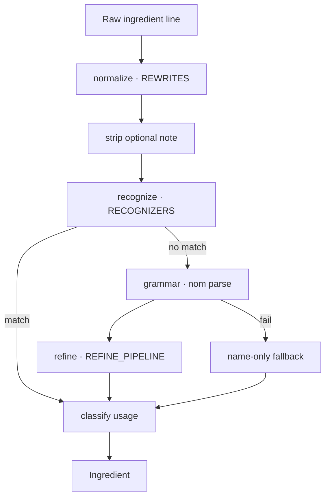

# ingredient-parser

[](https://docs.rs/ingredient/latest/ingredient/)

**ingredient-parser** is a Rust library that uses [nom](https://github.com/Geal/nom) to parse ingredient lines from recipes into a structured, machine-readable format.

---

## Features

- Parses complex ingredient lines into structured data
- Supports multiple units and values per ingredient
- Extracts ingredient names and modifiers (e.g., "sifted", "chopped")
- Handles common recipe notation and edge cases

---

## Parsing pipeline

Each ingredient line flows through four stages. Ordered tables in the codebase (`REWRITES`, `RECOGNIZERS`, `REFINE_PIPELINE`) are the single source of truth for each stage — add a row to extend.



| Stage | What it does | Example fix |
|-------|--------------|-------------|
| **normalize** | Pre-parse string rewrites | Strip footnote markers, lift dimensional asides |
| **recognize** | Whole-line special forms (first match wins) | `"Juice of 1 lemon"`, `"Flour — 2 cups"` |
| **grammar** | Nom combinators capture amounts, name, modifier | New unit token in measurement grammar |
| **refine** | Post-parse passes recover misplaced text | Move `"chopped"` from name into modifier |

To see which stage shaped a line: `cargo run -p food-cli --quiet -- parse-ingredient --explain "<line>"`

---

## Example

Given the input:

```
1¼ cups / 155.5 grams all-purpose flour, lightly sifted
```

The parser produces:

```rust
{
    name: "all-purpose flour",
    amounts: [
        Measure { unit: "cups", value: 1.25 },
        Measure { unit: "grams", value: 155.5 }
    ],
    modifier: Some("lightly sifted")
}
```

See more examples in the [documentation](https://docs.rs/ingredient/).

---

## Demo

Try it live: [ingredient.nickysemenza.com](https://ingredient.nickysemenza.com)

---


## Documentation

- [API Docs on docs.rs](https://docs.rs/ingredient/)

---

## Contributing

Contributions, issues, and feature requests are welcome! Please open an issue or pull request.

---

## License

MIT
