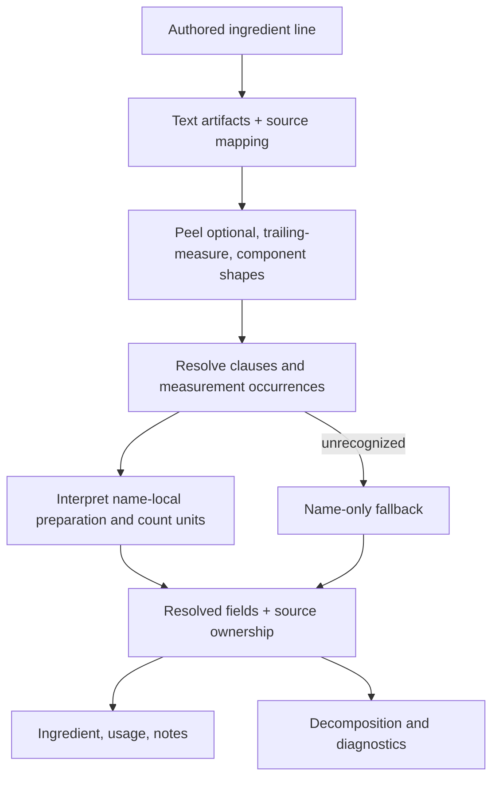

# ingredient-parser

[](https://docs.rs/ingredient/latest/ingredient/)

**ingredient-parser** is a Rust library that uses [nom](https://github.com/Geal/nom) to parse ingredient lines from recipes into a structured, machine-readable format.

---

## Features

- Parses complex ingredient lines into structured data
- Supports multiple units and values per ingredient
- Extracts ingredient names and modifiers (e.g., "sifted", "chopped")
- Handles common recipe notation and edge cases

---

## Parsing pipeline

The parser keeps authored source positions through structural interpretation.
Special forms compose with the same resolver; observations and the public result
come from that single execution. Names remain opaque, without a food ontology.


```mermaid
flowchart TD
    input["Authored ingredient line"] --> normalize["Text artifacts + source mapping"]
    normalize --> shapes["Peel optional, trailing-measure, component shapes"]
    shapes --> resolve["Resolve clauses and measurement occurrences"]
    resolve --> refine["Interpret name-local preparation and count units"]
    refine --> result["Resolved fields + source ownership"]
    resolve -->|unrecognized| fallback["Name-only fallback"]
    fallback --> result
    result --> output["Ingredient, usage, notes"]
    result --> observe["Decomposition and diagnostics"]
```

| Module | Responsibility |
|--------|----------------|
| **normalize** | Whitespace, list bullets and footnote artifacts; explicit source mappings |
| **recognize** | Composable whole-line shapes, interpreted without recursive parsing |
| **measurement** | Shared quantity, range and unit grammar for ingredients and rich text |
| **segment** | Clause relationships, alternatives, optional notes, references, aliases and secondary measures |
| **refine** | Source-backed extraction of preparation phrases and count-unit interpretation |

Ambiguous unquantified coordination remains in the name. Ingredient dimensions
and temperatures stay descriptive; standalone amount and instruction parsing
still recognize those measures. Modifier parts follow source order.

To see which stage shaped a line: `cargo run -p food-cli --quiet -- parse-ingredient --explain "<line>"`

---

## Example

Given the input:

```
1¼ cups / 155.5 grams all-purpose flour, lightly sifted
```

The parser produces:

```rust
{
    name: "all-purpose flour",
    amounts: [
        Measure { unit: "cups", value: 1.25 },
        Measure { unit: "grams", value: 155.5 }
    ],
    modifier: Some("lightly sifted")
}
```

See more examples in the [documentation](https://docs.rs/ingredient/).

---

## Demo

Try it live: [ingredient.nickysemenza.com](https://ingredient.nickysemenza.com)

---


## Documentation

- [API Docs on docs.rs](https://docs.rs/ingredient/)

---

## Contributing

Contributions, issues, and feature requests are welcome! Please open an issue or pull request.

---

## License

MIT
